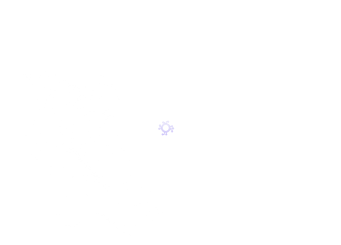

# Introduction

**Gada Labs** is a suite of tools that expose a properly crafted JSON-RPC 2.0 standard `SDK` for developers who have existing products built on web 2.0 technologies to seamlessly extend support for web 3.0 and also allow those looking to build web 3.0 products to easily do so whether or not they have web 3.0 development skills.

The Gada Labs `SDK` helps you save development time in the implementation of blockchain and `NFT` technology for your company in a 100% safe and reliable way.

We're excited about the innovative solution you’re building with Gada. Let us know if you have any questions via one of our community channels [discord](https://discord.com/gadalabs), [Twitter](https://twitter.com/gadalabs) or [community slack](https://slack.com/gadalabs).

At the core of Gada SDK lies an innovative solution that offers both developers from web 2.0 and web 3.0 the tools to build go-to-market products. A typical example of a complete lifecycle of a product that is built on top of Gada SDK will have a traversing tree similar to the one on the infographic below:

You can offer NFT solutions to your customers without any prior knowledge of blockchain. The Gada SDK makes it easy for every user on your application not to

## Good to have you in!

We're glad to have you join us in this journey of build to building innovative tools that'll empower developers with no web 3.0 skills to build and ship products with ease using the Gada Labs suite of tools. We're happy to have you join us. Join us via [discord](https://discord.com/gadalabs) or open a [pull request](https://github.com/gada-labs) one of our open source projects.

## Start your site

